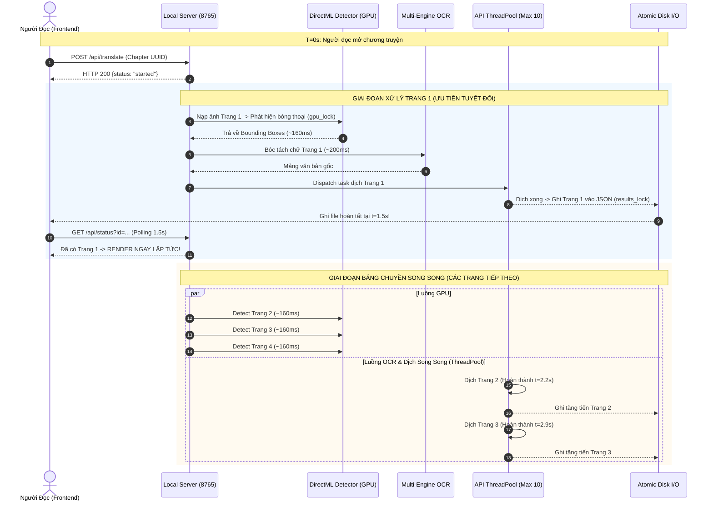
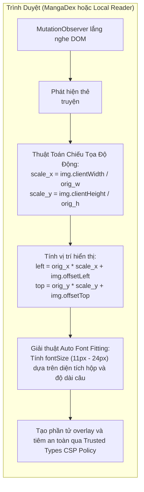
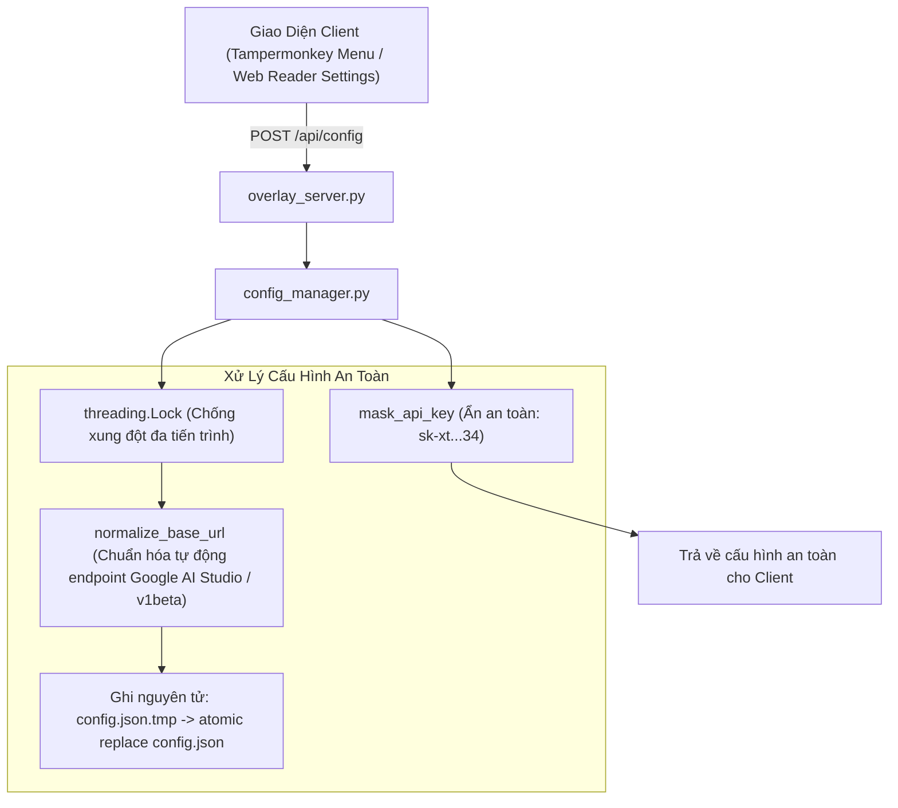

# Kiến Trúc Hệ Thống & Nguyên Lý Hoạt Động

> **Tài liệu đặc tả kỹ thuật chi tiết về kiến trúc phần mềm, giải thuật thị giác máy tính, luồng dữ liệu streaming và cơ chế vận hành của hệ thống MangaStream AI (Manga Translator Share).**

---

## Mục Lục
1. [Tổng Quan Kiến Trúc Hệ Thống (System Architecture)](#1-tổng-quan-kiến-trúc-hệ-thống-system-architecture)
2. [Hệ Thống Trí Tuệ Nhân Tạo & Các Engine Xử Lý Dữ Liệu](#2-hệ-thống-trí-tuệ-nhân-tạo--các-engine-xử-lý-dữ-liệu)
   - [Engine 1: Comic-Text-Detector ONNX (Phát hiện & Phân loại khung thoại)](#engine-1-comic-text-detector-onnx-phát-hiện--phân-loại-khung-thoại)
   - [Engine 2: Multi-Engine OCR Torchless (Nhận diện ký tự đa ngôn ngữ)](#engine-2-multi-engine-ocr-torchless-nhận-diện-ký-tự-đa-ngôn-ngữ)
   - [Engine 3: Google Translate Batch Stream (Dịch dòng dữ liệu siêu tốc)](#engine-3-google-translate-batch-stream-dịch-dòng-dữ-liệu-siêu-tốc)
   - [Engine 4: LLM Text-Only Translator (Dịch ngữ cảnh hội thoại sâu)](#engine-4-llm-text-only-translator-dịch-ngữ-cảnh-hội-thoại-sâu)
   - [Engine 5: Multimodal Vision LLM Translator (Dịch nhận thức thị giác)](#engine-5-multimodal-vision-llm-translator-dịch-nhận-thức-thị-giác)
3. [Băng Chuyền Xử Lý Streaming & Cơ Chế Đồng Bộ Đa Luồng](#3-băng-chuyền-xử-lý-streaming--cơ-chế-đồng-bộ-đa-luồng)
   - [Nguyên lý Time-To-First-Read (TTFR ~1.5s)](#nguyên-lý-time-to-first-read-ttfr-15s)
   - [Cơ chế đồng bộ an toàn: GPU Lock, ThreadPool & Atomic I/O](#cơ-chế-đồng-bộ-an-toàn-gpu-lock-threadpool--atomic-io)
4. [Đặc Tả Giao Thức REST API Local Backend (`overlay_server.py`)](#4-đặc-tả-giao-thức-rest-api-local-backend-overlay_serverpy)
5. [Cơ Chế Render & Client Frontend](#5-cơ-chế-render--client-frontend)
   - [MangaDex Overlay Userscript (`mangadex_overlay.user.js`)](#mangadex-overlay-userscript-mangadex_overlayuserjs)
   - [Local Web Reader SPA (`web_reader/`)](#local-web-reader-spa-web_reader)
6. [Quản Trị Cấu Hình & Hệ Thống Đa Hồ Sơ (`config_manager.py`)](#6-quản-trị-cấu-hình--hệ-thống-đa-hồ-sơ-config_managerpy)
7. [Bảo Mật & Quy Trình Khởi Động Offline (`download_models.py`)](#7-bảo-mật--quy-trình-khởi-động-offline-download_modelspy)

---

## 1. Tổng Quan Kiến Trúc Hệ Thống (System Architecture)

Hệ thống được xây dựng theo mô hình **Client-Server Cục Bộ Bất Đối Xứng (Local Decoupled Architecture)**. Toàn bộ tác vụ nặng liên quan đến suy luận trí tuệ nhân tạo (Inference AI), xử lý ma trận ảnh và giao tiếp API mạng được cô lập hoàn toàn tại Local Backend, giúp trình duyệt của người dùng hoạt động mượt mà, không gặp hiện tượng nghẽn đơn luồng hay đơ tab (UI freeze).

```mermaid
flowchart TD
    subgraph Clients["1. TẦNG GIAO DIỆN CLIENT (FRONTEND)"]
        direction TB
        C1["MangaDex Web + Userscript Overlay<br/>- Bắt sự kiện DOM MangaDex qua MutationObserver<br/>- Tự động tách Chapter UUID & tải URL ảnh<br/>- Chiếu tọa độ Responsive & phủ bản dịch lên bóng thoại"]
        C2["Local Web Reader SPA (Single-Page App)<br/>- Kéo thả thư mục truyện từ ổ đĩa cục bộ<br/>- Chế độ đọc Webtoon dọc / Từng trang đơn<br/>- Tùy chỉnh Font, màu nền giấy, độ mờ hộp thoại"]
    end

    subgraph Backend["2. TẦNG ĐIỀU PHỐI CỤC BỘ (LOCAL BACKEND SERVER)"]
        direction TB
        S1["overlay_server.py (Cổng 8765)<br/>- Máy chủ HTTP đa luồng (ThreadingHTTPServer)<br/>- Bộ điều hướng RESTful API & Cung cấp tĩnh SPA Web Reader<br/>- Hỗ trợ CORS toàn phần cho trình duyệt & Tampermonkey"]
        CFG["config_manager.py (Quản lý cấu hình)<br/>- Quản lý Multi-Profile API Key / Model / Base URL<br/>- Khóa loại trừ tương hỗ (threading.Lock)<br/>- Mặt nạ bảo mật API Key trên giao diện"]
        S1 <--> CFG
    end

    subgraph Pipeline["3. BĂNG CHUYỀN DỊCH STREAMING (PIPELINE DISPATCH)"]
        direction TB
        F1["MangaDex Fetcher / Local Loader<br/>- Trích xuất metadata & URLs ảnh<br/>- Tải trang ưu tiên và nạp vào bộ đệm cache"]
        
        DET["Comic-Text-Detector ONNX<br/>- Định vị khung thoại trên GPU DirectML / CPU<br/>- Phân loại & sắp xếp thứ tự đọc Manga (Top-to-Bottom, Right-to-Left)"]
        
        F1 --> DET
        
        DET -->|Nhánh A: Tách chữ & Dịch văn bản| PA["Pipeline OCR + Text Translation<br/>(Tiết kiệm 95% chi phí token, tốc độ cao)"]
        DET -->|Nhánh B: Đánh dấu nhãn & Dịch ảnh| PB["Pipeline Vision Multimodal<br/>(Hiểu biểu cảm khuôn mặt & bối cảnh tranh)"]
        
        subgraph EngineA["Các Engine Nhánh A"]
            OCR["Multi-Engine OCR Torchless<br/>- Manga-OCR ONNX (Tiếng Nhật)<br/>- RapidOCR ONNX (Tiếng Anh / Tiếng Trung)"]
            TRANS["Bộ Dịch Lựa Chọn<br/>- Google Translate Batch Stream (Miễn phí)<br/>- LLM Text-Only (Qwen / DeepSeek / Gemini)<br/>- Raw Text (Giữ nguyên bản gốc)"]
            OCR --> TRANS
        end
        
        subgraph EngineB["Các Engine Nhánh B"]
            SOM["Set-of-Mark Processing<br/>Vẽ nhãn số [1], [2] và khung màu nổi bật"]
            VLLM["Multimodal Vision LLM API<br/>Qwen 3.5 / Gemini 2.0 Flash qua Base URL"]
            SOM --> VLLM
        end
        
        PA --> OCR
        PB --> SOM
        
        OUT["Bộ Ghi Đĩa Tăng Tiến (Atomic Incremental Dispatch)<br/>- Ghi file JSON từng trang ngay khi hoàn tất (t=1.5s)<br/>- Phát thông báo trạng thái phục vụ Frontend render tức thì"]
        
        TRANS --> OUT
        VLLM --> OUT
    end

    Clients <-->|HTTP REST / Long Polling (Cổng 8765)| Backend
    Backend <-->|ThreadPoolExecutor & Event Callback| Pipeline
    OUT -.->|Đọc dữ liệu JSON hoàn tất| S1
```

### Các nguyên lý thiết kế then chốt:
1. **Zero-Latency First Page (Ưu tiên trang đầu)**: Thay vì tải và dịch tuần tự toàn bộ chapter (thường mất 40s - 90s), hệ thống giải phóng ngay kết quả của Trang 1 sau **~1.5s - 2.0s**. Người đọc có thể bắt đầu đọc ngay lập tức trong khi các trang còn lại tiếp tục được xử lý ngầm trong nền.
2. **Resource Isolation (Cô lập tài nguyên)**: Tách rời hoàn toàn giao diện hiển thị trên trình duyệt khỏi tiến trình tính toán AI. Nếu trình duyệt đóng tab hoặc tải lại, tiến trình dịch ngầm tại Local Server vẫn tiếp tục hoạt động mà không bị gián đoạn.
3. **Cross-Vendor Hardware Acceleration (Tăng tốc phần cứng đa nền tảng)**: Sử dụng execution provider `DmlExecutionProvider` (DirectX 12 DirectML) của ONNX Runtime, cho phép khai thác trực tiếp năng lực GPU của **AMD Radeon, NVIDIA GeForce, và Intel Iris Xe/Arc** trên Windows mà không cần cài đặt bộ công cụ PyTorch hay CUDA cồng kềnh.

---

## 2. Hệ Thống Trí Tuệ Nhân Tạo & Các Engine Xử Lý Dữ Liệu

Kiến trúc xử lý trí tuệ nhân tạo được mô-đun hóa thành hai pipeline chuyên biệt đáp ứng nhu cầu tối ưu chi phí hoặc tối ưu văn phong ngữ cảnh:

```mermaid
flowchart TD
    IMG["Ảnh Trang Truyện Gốc (Original Image)"] --> PRE["Tiền Xử Lý: Letterbox Resize 1024x1024, Padding, Float32 / 255.0"]
    PRE --> CTD["Comic-Text-Detector ONNX (DirectML GPU / CPU)<br/>Thời gian suy luận: ~120ms - 170ms"]
    
    CTD --> POST["Hậu Xử Lý Bounding Box:<br/>- Lọc ngưỡng tự tin (obj_conf > 0.18, score > 0.14)<br/>- Non-Maximum Suppression (NMS threshold = 0.35)<br/>- Lọc nhiễu kích thước (bw > 25, bh > 20)"]
    
    POST --> RO["Thuật Toán Sắp Xếp Thứ Tự Đọc Manga (Manga Reading Order):<br/>- Gom cụm theo trục Y với dung sai y_threshold = h * 0.10<br/>- Sắp xếp trong tầng từ Phải sang Trái (-cx)<br/>- Gán định danh tuần tự (ID = 1, 2, 3...)"]
    
    RO --> BRANCH{Lựa Chọn Pipeline Hệ Thống}
    
    BRANCH -->|Pipeline ocr_trans| OCR_SWITCH{Chọn Engine OCR Theo Ngôn Ngữ}
    OCR_SWITCH -->|Tiếng Nhật (ja)| M_OCR["Manga-OCR ONNX<br/>(ViT + RoBERTa/BERT Torchless)"]
    OCR_SWITCH -->|Tiếng Anh (en)| R_OCR_EN["RapidOCR ONNX (PaddleOCR Latinh)<br/>Tách dòng, sắp xếp Y, giữ nguyên khoảng trắng"]
    OCR_SWITCH -->|Tiếng Trung (zh)| R_OCR_ZH["RapidOCR ONNX (PaddleOCR Hán ngữ)<br/>Ghép liền chuỗi văn bản không dấu cách"]
    
    M_OCR --> T_SWITCH{Chọn Bộ Dịch}
    R_OCR_EN --> T_SWITCH
    R_OCR_ZH --> T_SWITCH
    
    T_SWITCH -->|Google Translate| G_TR["Google Translate Batch Stream<br/>Ghép chuỗi bằng '\\n' qua endpoint clients5 chống 429"]
    T_SWITCH -->|LLM Text-Only| LLM_TR["LLM Text-Only API (OpenAI Compatible)<br/>Prompt dịch chuyên ngữ manga, auto fallback sang Google"]
    T_SWITCH -->|Raw Mode| RAW_TR["Giữ Nguyên Ký Tự Gốc Đã OCR"]
    
    BRANCH -->|Pipeline image_trans| SOM["Set-of-Mark Processing<br/>Vẽ viền khung màu và nhãn số [1], [2] trực tiếp lên ảnh"]
    SOM --> V_LLM["Multimodal Vision LLM (Qwen 3.5 / Gemini Flash)<br/>Dịch nhận thức biểu cảm nhân vật qua hình ảnh"]
    
    G_TR --> MERGE["Đóng gói mảng JSON kết quả trang"]
    LLM_TR --> MERGE
    RAW_TR --> MERGE
    V_LLM --> MERGE
```

---

### Engine 1: Comic-Text-Detector ONNX (Phát hiện & Phân loại khung thoại)

* **File mô hình:** `models/comic-text-detector.onnx` (~94 MB).
* **Nguồn gốc:** Mạng nơ-ron tích chập (CNN) được huấn luyện chuyên biệt trên tập dữ liệu truyện tranh quy mô lớn để định vị bóng thoại thuộc mọi hình dạng (tròn, oval, chữ nhật, bong bóng gai hành động, văn bản nằm ngoài viền).
* **Cấu hình suy luận (Inference Options):**
  - Khởi tạo qua [`onnxruntime.InferenceSession`](file:///c:/Vide_coding/Manga-Translator-Share/mangadex_batch_translator.py#L900) với `providers=['DmlExecutionProvider', 'CPUExecutionProvider']`.
  - Kích hoạt tối ưu đồ thị cấp cao: `GraphOptimizationLevel.ORT_ENABLE_ALL`.
  - Khóa đồng bộ GPU: [`gpu_lock`](file:///c:/Vide_coding/Manga-Translator-Share/mangadex_batch_translator.py#L63) đảm bảo suy luận tuần tự, tránh tranh chấp tài nguyên VRAM khi nhiều luồng cùng gọi.
  - Thời gian suy luận trung bình: **120ms – 170ms** / trang 2K.

#### 1. Tiền xử lý (Preprocessing):
1. **Bảo toàn tỷ lệ khung hình (Aspect-Ratio Letterboxing):**
   - Hệ số co giãn: `scale = 1024 / max(h, w)`
   - Kích thước mới: `nw = int(w * scale)`, `nh = int(h * scale)`
2. **Đắp đệm (Zero-Padding):** Khởi tạo ma trận `1024 x 1024 x 3` chứa giá trị `0`, gán ảnh đã co giãn vào góc trái trên `[:nh, :nw]`.
3. **Chuẩn hóa điểm ảnh:** Quy đổi giá trị pixel `uint8 [0, 255]` về kiểu số thực `float32 [0.0, 1.0]` và chuyển đổi định dạng kênh tensor `(1, 3, 1024, 1024)`.

#### 2. Hậu xử lý & Triệt tiêu phi cực đại (Postprocessing & NMS):
1. Quét từng vector đặc trưng trong output tensor:
   - Ngưỡng tin cậy vật thể (Object Confidence): `obj_conf > 0.18`.
   - Xác định phân lớp văn bản: `cls_id = int(np.argmax(row[5:]))`.
   - Điểm số tổng hợp: `score = obj_conf * row[5 + cls_id] > 0.14`.
2. Chuyển đổi tọa độ tâm `[cx, cy, bw, bh]` ngược về hệ tọa độ gốc của trang truyện theo hệ số `1 / scale`.
3. Áp dụng thuật toán **Non-Maximum Suppression** qua `cv2.dnn.NMSBoxes` với `score_threshold=0.14` và `nms_threshold=0.35` để loại bỏ hoàn toàn các khung trùng lặp.
4. Lọc nhiễu kích thước tối thiểu: Bỏ qua các khung thoại nhỏ hơn `25 x 20 pixel` (`bw > 25 and bh > 20`).

#### 3. Thuật toán phân tầng & sắp xếp thứ tự đọc Manga (Topological Reading Order):
Truyện tranh Nhật Bản đọc từ **Phải sang Trái** và từ **Trên xuống Dưới**. Nếu chỉ sắp xếp đơn thuần theo tọa độ `y` hoặc `x`, các khung thoại nằm cùng một hàng ngang sẽ bị đảo lộn thứ tự đối thoại. Thuật toán được cài đặt như sau:
1. Sắp xếp toàn bộ bóng thoại tăng dần theo tọa độ tâm trục đứng (`cy`).
2. Thiết lập ngưỡng phân tầng: `y_threshold = h * 0.10` (10% chiều cao trang ảnh).
3. Gom các bóng thoại có độ chênh lệch tâm dọc nhỏ hơn `y_threshold` vào cùng một "tầng" (Tier).
4. Trong từng tầng, sắp xếp các bóng thoại theo chiều giảm dần của tọa độ hoành độ tâm (`-cx`), tức từ **Phải sang Trái**.
5. Gán định danh số nguyên tăng dần (`id = 1, 2, 3...`) cho danh sách đã sắp xếp.

---

### Engine 2: Multi-Engine OCR Torchless (Nhận diện ký tự đa ngôn ngữ)

Hệ thống tích hợp 3 engine bóc tách văn bản cục bộ chạy hoàn toàn bằng ONNX Runtime, độc lập 100% với PyTorch:

| Engine OCR | Mô hình & Nền tảng | Ngôn ngữ tối ưu | Đặc tính kỹ thuật & Chuẩn hóa |
| :--- | :--- | :--- | :--- |
| **`manga_ocr`** | `mayocream/manga-ocr-onnx` (~870 MB) | Tiếng Nhật (ja) | - Kiến trúc ViT Encoder + RoBERTa/BERT Decoder tự hồi quy.<br/>- Bóc chính xác Kanji phức tạp, Furigana dọc/ngang, chữ viết tay.<br/>- Tự động chuẩn hóa qua `jaconv.h2z` (chuyển đổi Half-width sang Full-width, chuẩn hóa dấu ngoặc và dấu chấm lửng `...`). |
| **`rapid_ocr_en`** | `rapidocr-onnxruntime` (~15 MB) | Tiếng Anh (en) / Ký tự Latinh | - Nền tảng PaddleOCR ONNX siêu nhẹ.<br/>- Nhận diện font chữ truyện tranh hoa/thường, font nghệ thuật.<br/>- Sắp xếp các đoạn text theo tọa độ dọc và nối bằng dấu cách chuẩn xác (`" ".join(texts)`), ngăn chặn triệt để lỗi dính từ. |
| **`rapid_ocr_ch`** | `rapidocr-onnxruntime` (~15 MB) | Tiếng Trung (zh) | - Hỗ trợ toàn diện chữ Hán Giản thể (Simplified) và Phồn thể (Traditional).<br/>- Tự động ghép liền chuỗi (`"".join(texts)`), loại bỏ khoảng trống thừa. |

#### Cơ chế Tự Động Nhận Diện Ngôn Ngữ & Khóa Ghi Đè Thủ Công (Auto-detect & Manual Override):
1. **Tự động nhận diện (Auto-detect):** Khi người dùng mở chapter trên MangaDex, Userscript đọc trường metadata `translatedLanguage` từ API. Hệ thống tự động kích hoạt Engine tương ứng:
   - `ja` -> Kích hoạt `manga_ocr`.
   - `zh` hoặc `zh-hk` -> Kích hoạt `rapid_ocr_ch`.
   - `en` hoặc các ngôn ngữ Latinh khác -> Kích hoạt `rapid_ocr_en`.
2. **Khóa ghi đè thủ công (Manual Override):** Khi uploader trên MangaDex gắn nhầm cờ ngôn ngữ (ví dụ truyện tiếng Nhật nhưng gắn cờ tiếng Anh), người dùng chỉ cần chọn lại Engine OCR trên menu UI. Userscript sẽ thiết lập cờ `isManualOverride = true`, khóa cứng lựa chọn này và vô hiệu hóa cơ chế tự động can thiệp cho đến khi người dùng chọn lại chế độ `Auto`.

---

### Engine 3: Google Translate Batch Stream (Dịch dòng dữ liệu siêu tốc)

* **Cơ chế:** Giao tiếp trực tiếp qua giao thức HTTP REST với máy chủ dịch thuật của Google.
* **Chiến thuật Gom Cụm Dòng Văn Bản (Batch Line Aggregation):**
  - Thay vì gửi từng HTTP request cho từng bóng thoại riêng lẻ (gây trễ mạng lớn và dễ bị chặn IP do tần suất request cao), hệ thống nối toàn bộ văn bản của trang thành một chuỗi duy nhất thông qua ký tự xuống dòng `\n`.
  - Một trang truyện có từ 8 – 20 bóng thoại được đóng gói và hoàn thành chỉ trong **1 HTTP Request duy nhất**.
* **Phân cấp Endpoint chống lỗi 429 (Rate-Limit Resilience):**
  1. **Ưu tiên 1:** Gọi endpoint Chrome Dictionary Extension: `https://clients5.google.com/translate_a/t?client=dict-chrome-ex&sl=auto&tl=vi`. Endpoint này có hạn mức chịu tải rất cao và không bị kích hoạt mã lỗi HTTP 429 Too Many Requests.
  2. **Ưu tiên 2 (Fallback):** Tự động chuyển đổi sang endpoint công cộng `https://translate.googleapis.com/translate_a/single?client=gtx` nếu endpoint chính gặp sự cố kết nối.
  3. **Ưu tiên 3 (Individual Fallback):** Nếu định dạng phân tách chuỗi thất bại do văn bản gốc chứa ký tự điều khiển lạ, hệ thống tự động fallback sang cơ chế dịch từng câu độc lập.
* **Độ trễ:** **~150ms – 250ms** / toàn bộ trang truyện.
* **Chi phí:** Miễn phí 100%, không yêu cầu API Key.

---

### Engine 4: LLM Text-Only Translator (Dịch ngữ cảnh hội thoại sâu)

Dành cho người đọc yêu cầu chất lượng dịch thuật văn học cao cấp, hiểu rõ đại từ nhân xưng và tính cách nhân vật mà vẫn duy trì tốc độ cao.

* **Tiết kiệm Token vượt trội:** Thay vì gửi toàn bộ bức ảnh tốn từ 1,500 – 3,000 token/trang, chế độ này chỉ gửi mảng JSON văn bản thuần đã bóc tách từ OCR. Mức tiêu thụ token chỉ khoảng **80 – 150 token/trang** (giảm hơn 95% chi phí).
* **Đặc tả Prompt & Định dạng trao đổi:**
  ```json
  [
    {"id": 1, "text": "お前… 本当にそれでいいのか？"},
    {"id": 2, "text": "ああ、後悔はない。行くぞ！"}
  ]
  ```
  Hệ thống ra chỉ thị nghiêm ngặt yêu cầu LLM giữ nguyên thuộc tính `id`, dịch thoát ý theo phong cách truyện tranh Việt Nam và chỉ phản hồi duy nhất mảng JSON:
  ```json
  [
    {"id": 1, "vi": "Cậu... thực sự ổn với quyết định đó chứ?"},
    {"id": 2, "vi": "Ừ, tôi không hối hận đâu. Đi thôi!"}
  ]
  ```
* **Cơ chế phân tích cú pháp an toàn (Resilient JSON Parsing):**
  1. Trích xuất chuỗi JSON bằng biểu thức chính quy (Regex) loại bỏ các khối markdown ` ```json ` hoặc văn bản mở đầu của LLM.
  2. Fallback bóc tách theo cặp khóa-giá trị qua Regex nếu JSON bị lỗi dấu phẩy hoặc escape ký tự đặc biệt.
  3. **Tự động Fallback sang Google Translate:** Nếu API LLM gặp lỗi mạng (HTTP 500, Timeout, hết hạn mức tín dụng), hệ thống ngay lập tức chuyển các câu thoại sang Google Translate để người dùng luôn có bản dịch đọc ngay, tuyệt đối không bao giờ để trang truyện bị bỏ trống.

---

### Engine 5: Multimodal Vision LLM Translator (Dịch nhận thức thị giác)

* **Phương pháp Set-of-Mark (SoM):**
  1. Sử dụng OpenCV vẽ trực tiếp khung viền chữ nhật màu nổi bật và đánh nhãn số to rõ ràng `[1]`, `[2]`, `[3]` ngay tại tâm của từng bóng thoại trên ảnh gốc.
  2. Mã hóa ảnh đã gắn nhãn thành chuỗi Base64 Data URL và gửi kèm prompt đến mô hình Vision (Qwen 3.5 Vision, Gemini 2.0 Flash).
* **Ưu thế vượt trội:** Mô hình thị giác có thể quan sát trực tiếp biểu cảm khuôn mặt (giận dữ, đỏ mặt ngại ngùng, cười đùa) và mối quan hệ bối cảnh giữa các nhân vật để lựa chọn đại từ nhân xưng phù hợp (anh - em, tớ - cậu, mày - tao) mà phương pháp OCR văn bản thuần không thể giải quyết trọn vẹn.

---

## 3. Băng Chuyền Xử Lý Streaming & Cơ Chế Đồng Bộ Đa Luồng

Khác biệt cốt lõi tạo nên tốc độ ấn tượng của MangaStream AI là kiến trúc **Băng Chuyền Độc Lập Bất Đồng Bộ (Asynchronous Streaming Pipeline)**:



### Nguyên lý Time-To-First-Read (TTFR ~1.5s)
- Trang mở đầu luôn được xếp ở đầu danh sách nhiệm vụ.
- Trong khi người đọc đang đọc nội dung của Trang 1 (thường mất từ 10s đến 30s), toàn bộ các trang còn lại của chapter đã được xử lý xong trong nền. Người dùng hoàn toàn không cảm nhận được độ trễ khi chuyển sang các trang tiếp theo.

### Cơ chế đồng bộ an toàn: GPU Lock, ThreadPool & Atomic I/O
1. **Khóa loại trừ tương hỗ GPU (`gpu_lock`):** Các mô hình DirectML chạy thông qua DirectX 12 rất nhạy cảm với việc phân bổ VRAM đồng thời từ nhiều luồng. [`gpu_lock`](file:///c:/Vide_coding/Manga-Translator-Share/mangadex_batch_translator.py#L63) đảm bảo tại một thời điểm chỉ có duy nhất 1 trang được thực hiện suy luận trên GPU, loại trừ 100% nguy cơ tràn bộ nhớ đồ họa hoặc xung đột context phần cứng.
2. **Hồ bơi luồng dịch thuật (`ThreadPoolExecutor`):** Các tác vụ I/O mạng (gọi API Google Translate hoặc LLM) không tiêu tốn GPU, do đó được đẩy vào `ThreadPoolExecutor(max_workers=10)` để thực thi đồng thời tối đa 10 trang cùng lúc.
3. **Ghi đĩa tăng tiến nguyên tử ([`save_json_safely`](file:///c:/Vide_coding/Manga-Translator-Share/mangadex_batch_translator.py#L834)):**
   - Sau khi mỗi trang hoàn thành, dữ liệu được nạp vào cấu trúc JSON tổng và bảo vệ bởi [`results_lock`](file:///c:/Vide_coding/Manga-Translator-Share/mangadex_batch_translator.py#L923).
   - Hàm `save_json_safely` ghi dữ liệu ra một file tạm thời `.tmp`, sau đó thực hiện lệnh đổi tên nguyên tử `os.replace(tmp_path, target_path)`. Cơ chế này ngăn chặn tuyệt đối tình trạng Frontend đọc phải file JSON đang trong trạng thái ghi dở (Corrupted/Truncated Read).

---

## 4. Đặc Tả Giao Thức REST API Local Backend (`overlay_server.py`)

Máy chủ Backend khởi chạy trên tiến trình đa luồng [`ThreadingHTTPServer`](file:///c:/Vide_coding/Manga-Translator-Share/overlay_server.py#L55) tại địa chỉ mặc định `http://127.0.0.1:8765`. Tất cả các phản hồi đều tự động đính kèm tiêu đề CORS `Access-Control-Allow-Origin: *`.

| Phương thức | Đường dẫn API | Tham số đầu vào | Mô tả chức năng & Cấu trúc phản hồi |
| :--- | :--- | :--- | :--- |
| **GET** | `/api/config` | Query: `full=1` (tùy chọn) | Trả về cấu hình hiện tại của hệ thống. Nếu `full=0`, trường `api_key` sẽ được che bằng mặt nạ bảo mật (ví dụ: `sk-xt...34`). |
| **POST** | `/api/config` | Body JSON: `{...}` | Cập nhật cấu hình hệ thống, chuyển đổi profile hoạt động, lưu vào `config.json`. |
| **GET** | `/api/chapters` | Không | Liệt kê toàn bộ các chapter đã dịch xong trên đĩa và các chapter đang trong tiến trình dịch ngầm. |
| **GET** | `/api/chapter` | Query: `id={chapter_id}` | Lấy chi tiết toàn bộ dữ liệu bản dịch (tọa độ khung, văn bản gốc, bản dịch tiếng Việt) của một chapter. Trả về `404` nếu chưa có dữ liệu. |
| **GET** | `/api/status` | Query: `id={chapter_id}` | Kiểm tra tiến độ dịch theo thời gian thực: `{status: "running"\|"done"\|"error", completed_pages: 5, total_pages: 20}`. Phục vụ cơ chế Long Polling của Frontend. |
| **GET** | `/api/chapter-info`| Query: `id={chapter_id}` | Truy vấn metadata từ MangaDex@Home API (tiêu đề chương, tập, ngôn ngữ gốc, tổng số trang). |
| **POST** | `/api/test-api` | Body JSON: `{profile_id, api_key, base_url, model}` | Thử nghiệm kết nối tới endpoint LLM, đo đạc tính hợp lệ của key và thời gian phản hồi (Latency ms). |
| **POST** | `/api/translate` | Body JSON: `{chapter_id, pipeline_type, translation_provider, ocr_engine}` | Khởi chạy tiến trình tải và dịch ngầm cho chapter được chỉ định trong một Background Thread độc lập. |
| **POST** | `/api/upload-chapter` | Multipart Form: `images`, `title`, `pipeline_type`, `ocr_engine` | Tải lên tập hợp file ảnh từ máy tính (Local Manga Upload), tự động giải nén qua module `email`, sắp xếp số tự nhiên và kích hoạt dịch ngầm. |
| **GET** | `/images/{id}/{fn}` | URL Params | Phục vụ trực tiếp file ảnh truyện từ thư mục bộ đệm `cache_chapters/` cho Local Web Reader. |
| **GET** | `/mangadex_overlay.user.js` | Không | Cung cấp file mã nguồn Userscript cho Tampermonkey cài đặt hoặc cập nhật phiên bản 1-click. |
| **GET** | `/`, `/reader`, `/settings` | Không | Điều hướng và phục vụ mã nguồn tĩnh của ứng dụng SPA Local Web Reader (`web_reader/index.html`). |

---

## 5. Cơ Chế Render & Client Frontend



---

### MangaDex Overlay Userscript (`mangadex_overlay.user.js`)

#### 1. Khả năng tương thích chính sách bảo mật CSP Trusted Types
MangaDex triển khai chính sách bảo mật nghiêm ngặt `Content-Security-Policy: require-trusted-types-for 'script'`. Các lệnh can thiệp DOM thông thường như `element.innerHTML = html` sẽ lập tức bị trình duyệt chặn đứng. Userscript giải quyết bằng cách khởi tạo một chính sách an toàn:
```javascript
const ttPolicy = window.trustedTypes.createPolicy('manga-overlay', {
    createHTML: (string) => string
});
```
Mọi thao tác chèn giao diện đều đi qua hàm đóng gói [`setSafeHTML`](file:///c:/Vide_coding/Manga-Translator-Share/mangadex_overlay.user.js#L132), đảm bảo tính hợp lệ tuyệt đối trên mọi phiên bản Chrome và Firefox.

#### 2. Giám sát DOM không nghẽn tab (Non-blocking MutationObserver)
- Sử dụng `MutationObserver` lắng nghe các phần tử ảnh `.reader--page img` được tải lười (Lazy-loading) khi người dùng cuộn truyện.
- Thiết lập cờ trạng thái [`State.isUpdatingDOM`](file:///c:/Vide_coding/Manga-Translator-Share/mangadex_overlay.user.js#L48) kết hợp kỹ thuật Debounce: Khi Userscript đang chèn khung đè, mọi sự kiện biến đổi DOM phát sinh từ chính thao tác chèn này sẽ bị bỏ qua, ngăn chặn triệt để vòng lặp đệ quy vô hạn làm đơ trình duyệt.

#### 3. Thuật toán biến đổi hệ tọa độ co giãn (Dynamic Coordinate Projection)
Tọa độ lưu trữ trong file JSON là tọa độ pixel tĩnh trên ảnh gốc độ phân giải cao (`original_width x original_height`). Khi hiển thị trên trình duyệt, ảnh bị co giãn responsive theo chiều rộng màn hình. Userscript tính toán ma trận co giãn động thời gian thực:
- `scale_x = img.clientWidth / original_width`
- `scale_y = img.clientHeight / original_height`
- `box_left = orig_x * scale_x + img.offsetLeft`
- `box_top = orig_y * scale_y + img.offsetTop`
- `box_width = orig_w * scale_x`
- `box_height = orig_h * scale_y`

Nhờ đó, khung bản dịch luôn khớp hoàn hảo trên từng pixel của quả bóng thoại dù người dùng phóng to, thu nhỏ trình duyệt hay xoay màn hình thiết bị.

#### 4. Giải thuật tự động thích ứng kích thước chữ (Auto Font Fitting)
Dựa trên diện tích vùng chứa khả dụng (`area = box_width * box_height`) và tổng số ký tự của câu dịch tiếng Việt, giải thuật tự động tính toán cỡ chữ tối ưu:
- Kích thước chữ dao động mượt mà trong dải từ `11px` đến `24px`.
- Nếu câu quá dài nằm trong bóng thoại hẹp, font sẽ tự động thu nhỏ và áp dụng thuộc tính `line-height: 1.15` kèm căn giữa đa chiều (Flexbox Centering) để văn bản luôn nằm gọn trong quả bóng trắng mà không bị tràn viền (Text Overflow).

---

### Local Web Reader SPA (`web_reader/`)

Dành cho nhu cầu đọc truyện offline từ các thư mục ảnh tải về máy:

1. **Kiến trúc SPA hợp nhất (Zero-Reload Architecture):**
   - Tích hợp toàn bộ màn hình **Đọc Truyện (`#reader`)** và **Cài Đặt Hệ Thống (`#settings`)** vào chung một file `web_reader/index.html`.
   - Điều hướng thông qua cơ chế Hash Routing. Khi người dùng đang đọc ở Trang 25 và chuyển sang tab Cài Đặt để chỉnh API Key, khi bấm quay lại tab Đọc truyện, trạng thái cuộn trang và vị trí đọc được bảo toàn nguyên vẹn 100%.
2. **Hệ thống thiết kế Sổ Tay Manga (Hand-Drawn Notebook Design System):**
   - **Màu nền giấy tự nhiên:** Nền giấy ấm `#fdfbf7` kết hợp hoa văn chấm bi ghi chú (`radial-gradient` 24px) giúp người đọc không bị mỏi mắt khi đọc truyện liên tục.
   - **Đường viền hữu cơ (Wobbly Borders):** Áp dụng các giá trị `border-radius` bất đối xứng kết hợp nét viền chì mềm `#2d2d2d` dày 2.5px.
   - **Bóng đổ cứng (Hard Offset Cut-Paper Shadows):** Hiệu ứng cắt giấy nổi 4px/6px với độ mờ bằng 0 (Zero blur). Khi click nút, phần tử lún phẳng vào mặt giấy (`transform: translate(4px, 4px)`).
   - **Typography viết tay chuẩn mực:** Sử dụng font bút dạ lông `Kalam` cho tiêu đề và nút bấm, kết hợp font chữ viết tay tự nhiên `Patrick Hand` cho nội dung mô tả.

---

## 6. Quản Trị Cấu Hình & Hệ Thống Đa Hồ Sơ (`config_manager.py`)

Tệp cấu hình [`config.json`](file:///c:/Vide_coding/Manga-Translator-Share/config.json) được quản lý tập trung với cơ chế đồng bộ an toàn:



### Các tính năng cốt lõi:
1. **Multi-Profile API Management:** Cho phép cấu hình đồng thời nhiều hồ sơ dịch thuật (Google Translate Miễn Phí, xKiro DeepSeek V4, xKiro Qwen 3.5, Google AI Studio Gemini 2.0 Flash, OpenRouter). Người dùng có thể chuyển đổi hồ sơ hoạt động chỉ với một click.
2. **Tự động chuẩn hóa Base URL ([`normalize_base_url`](file:///c:/Vide_coding/Manga-Translator-Share/config_manager.py#L74)):** Tự động phát hiện và chuyển đổi các đường dẫn của Google AI Studio về đúng định dạng tương thích OpenAI (`https://generativelanguage.googleapis.com/v1beta/openai`).
3. **Che mờ API Key an toàn ([`mask_api_key`](file:///c:/Vide_coding/Manga-Translator-Share/config_manager.py#L87)):** Khi giao diện truy vấn cấu hình, chuỗi key chỉ hiển thị 6 ký tự đầu và 4 ký tự cuối (`sk-xt12...34`), ngăn chặn triệt để nguy cơ lộ API Key khi người dùng chụp ảnh màn hình hoặc quay video hướng dẫn.

---

## 7. Bảo Mật & Quy Trình Khởi Động Offline (`download_models.py`)

### 1. Nguyên tắc bảo mật bản chia sẻ (Zero-Leak Policy)
- Bản phân phối mã nguồn trên kho lưu trữ công khai được làm sạch 100% dữ liệu nhạy cảm.
- Tất cả các trường `api_key` trong `config.json` và `config.example.json` mặc định đều là chuỗi rỗng `""`.
- File [`.gitignore`](file:///c:/Vide_coding/Manga-Translator-Share/.gitignore) tự động loại trừ thư mục cache, file kết quả dịch và các file cấu hình chứa key cá nhân.

### 2. Quy trình nạp mô hình tự động & Kiểm thử Warm-up ([`download_models.py`](file:///c:/Vide_coding/Manga-Translator-Share/download_models.py))
Dự án được phân phối dưới dạng siêu nhẹ (~260 KB). Khi khởi chạy lần đầu:
1. Script kết nối tới HuggingFace Hub qua thư viện `huggingface_hub`:
   - Tải `comic-text-detector.onnx` (~94 MB) về thư mục `models/`.
   - Nạp snapshot `mayocream/manga-ocr-onnx` (~870 MB) vào bộ đệm cache hệ thống.
   - Nạp mô hình `rapidocr-onnxruntime` (~15 MB).
2. **Kiểm thử giả lập (Dummy Warm-up Test):** Script tự động tạo một ma trận ảnh trắng `100 x 30 pixel` và chạy thử một lượt suy luận qua DirectML. Bước này kích hoạt DirectX 12 biên dịch Shader đồ họa trước, đảm bảo khi người dùng đọc chương truyện đầu tiên, hệ thống sẽ phản hồi ngay lập tức mà không gặp bất kỳ độ trễ biên dịch nào.

---
*Tài liệu được cập nhật và đồng bộ chuẩn xác với cấu trúc mã nguồn phiên bản 2.5.*
