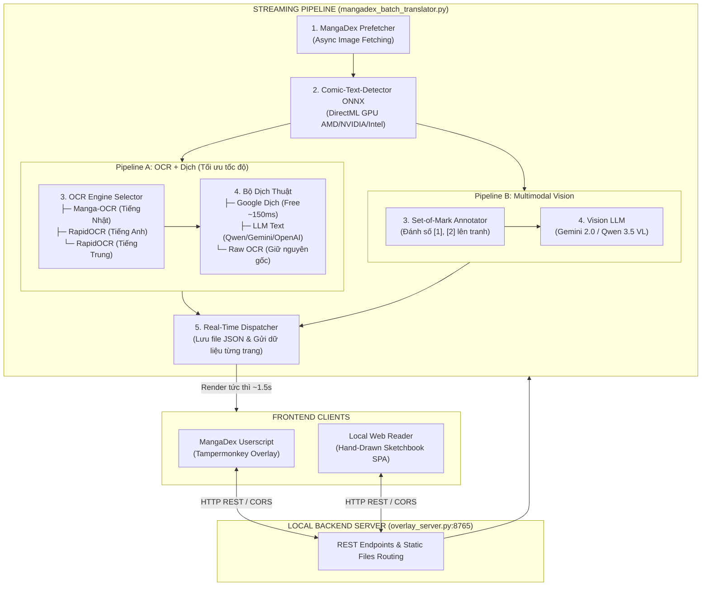

<div align="center">

# MangaStream AI — MangaDex Translator Overlay

> **Hệ thống dịch truyện tranh thời gian thực, đè bản dịch Tiếng Việt trực tiếp lên khung thoại trên MangaDex và Local Web Reader.**  
> Hỗ trợ đa ngôn ngữ (Tiếng Nhật, Tiếng Anh, Tiếng Trung), tăng tốc phần cứng qua DirectML (DirectX 12), kiến trúc Torchless tối ưu tài nguyên bộ nhớ.

[](https://www.python.org/)
[](https://learn.microsoft.com/en-us/windows/ai/directml/)
[](https://onnxruntime.ai/)
[](LICENSE)
[](https://github.com/thailong2103/manga-translator-mvp-demo)

[Tính Năng Cốt Lõi](#tính-năng-cốt-lõi) • [Kiến Trúc Hệ Thống](#kiến-trúc-hệ-thống) • [Hướng Dẫn Cài Đặt](#hướng-dẫn-cài-đặt-windows) • [Hướng Dẫn Sử Dụng](#hướng-dẫn-sử-dụng) • [Bảng So Sánh Kỹ Thuật](#bảng-so-sánh-kỹ-thuật) • [Khắc Phục Sự Cố](#khắc-phục-sự-cố-troubleshooting)

</div>

---

## Tính Năng Cốt Lõi

### 1. Cơ Chế Xử Lý Streaming Thời Gian Thực (Time-to-First-Read ~1.5s)
- Trang đầu tiên được tải, định vị khung thoại và hiển thị bản dịch tiếng Việt sau khoảng 1.5 giây.
- Xử lý bất đồng bộ đa luồng (tối đa 10 workers song song). Dữ liệu được ghi đĩa và gửi lên giao diện ngay khi từng trang hoàn thành, không bắt buộc tải toàn bộ chương truyện.

### 2. Hỗ Trợ Đa Mô Hình OCR (Torchless Architecture)
Sử dụng 3 mô hình ONNX chuyên dụng chạy qua DirectML, không phụ thuộc vào thư viện PyTorch:
- **Manga-OCR (Tiếng Nhật)**: Chuyên biệt nhận diện chữ Hán (Kanji), chữ dọc (Tate-gaki), Furigana và chữ viết tay trong Manga gốc.
- **RapidOCR (Tiếng Anh / Ký tự Latinh)**: Tối ưu bóc tách các font Comic in hoa nghệ thuật, bảo toàn dấu cách và cấu trúc câu scanlation.
- **RapidOCR (Tiếng Trung)**: Nhận diện chữ Hán Giản thể và Phồn thể trong Manhua Trung Quốc.

### 3. Tự Động Nhận Diện Ngôn Ngữ & Khóa Cứng Thủ Công
- **Smart Auto-Detect**: Tự động đọc mã ngôn ngữ chương truyện trên MangaDex để chuyển đổi mô hình OCR phù hợp (`ja` sang Manga-OCR, `zh` sang RapidOCR Trung, `en` sang RapidOCR Anh).
- **Manual Override**: Cho phép cố định một mô hình OCR trên thanh điều khiển để loại trừ lỗi gán sai cờ ngôn ngữ từ phía người đăng tải.

### 4. Hai Nhánh Pipeline Linh Hoạt (Dual-Pipeline Architecture)
- **Pipeline 1: OCR + Dịch**:
  - Dịch tự động qua Google Translate API (miễn phí, không cần API Key, phản hồi ~150ms/trang).
  - Hoặc dịch qua LLM Text-only (Qwen 3.5, Gemini 2.0 Flash, Claude, GPT-4o) nhằm tiết kiệm hơn 90% chi phí token so với mô hình Vision.
- **Pipeline 2: Image + Vision LLM**: Đánh số khung thoại Set-of-Mark `[1], [2]` trên ảnh gốc và gửi tới Vision Multimodal AI để dịch bám sát biểu cảm nhân vật.

### 5. Giao Diện Sổ Tay Độc Bản (Hand-Drawn Notebook Design System)
- Thiết kế theo phong cách sổ tay phác thảo truyện tranh:
  - Bảng màu giấy ấm `#fdfbf7`, hoa văn chấm bi giấy ghi chú, nét chì mềm `#2d2d2d`, bút dạ đỏ `#ff4d4d`.
  - Toàn bộ khung viền, nút bấm mang hình dáng wobbly hữu cơ bất đối xứng kết hợp bóng đổ cứng (hard offset shadow 4px).
  - Hệ thống icon vector SVG nét chì vẽ tay đồng bộ, loại bỏ hoàn toàn emoji hệ điều hành.
  - Tích hợp Trình Đọc và Cài Đặt trên cùng một ứng dụng SPA (Single-Page App), chuyển đổi không làm mới trang và bảo lưu trạng thái đọc.

### 6. An Toàn & Bảo Mật Cục Bộ
- Toàn bộ khóa API và dữ liệu cá nhân được lưu trữ cục bộ trên máy trạm.
- Tự động che mờ API Key trên giao diện, hỗ trợ quản lý nhiều cấu hình độc lập (Multi-Profile).

---

## Kiến Trúc Hệ Thống



---

## Hướng Dẫn Cài Đặt (Windows)

### Bước 1: Yêu Cầu Môi Trường
1. Cài đặt Python (phiên bản khuyến nghị: 3.10, 3.11 hoặc 3.12) từ [python.org](https://www.python.org/downloads/).
   > [!IMPORTANT]
   > Trong quá trình cài đặt, bắt buộc tích chọn ô: **"Add python.exe to PATH"**.
2. Cài đặt tiện ích mở rộng Tampermonkey trên trình duyệt ([Chrome / Edge / Brave](https://chromewebstore.google.com/detail/tampermonkey/dhdgffkkebhmkfjojejmpbldmpobfkfo) | [Firefox](https://addons.mozilla.org/vi/firefox/addon/tampermonkey/)).

### Bước 2: Tải Mã Nguồn & Cài Đặt Tự Động
1. Clone mã nguồn về máy:
   ```powershell
   git clone https://github.com/thailong2103/manga-translator-mvp-demo.git
   cd manga-translator-mvp-demo
   ```
2. Khởi chạy file cài đặt tự động:
   - Nhấp đúp vào **`install_requirements.bat`**.
   - Script sẽ thiết lập môi trường ảo `.venv`, cài đặt thư viện cần thiết và tải sẵn 3 mô hình AI (`comic-text-detector.onnx`, `manga-ocr-onnx`, `rapidocr`).

### Bước 3: Khởi Động Hệ Thống
1. Nhấp đúp vào file **`start_server.bat`**:
   - Máy chủ cục bộ sẽ chạy tại `http://127.0.0.1:8765`.
   - Trình duyệt tự động mở giao diện MangaStream Web Reader.
2. Cài đặt Userscript cho MangaDex:
   - Trên thanh điều hướng của Web Reader, bấm chọn **MangaDex Script**.
   - Chọn **Cài Đặt Userscript (1-Click)** và xác nhận trên tab Tampermonkey.

---

## Hướng Dẫn Sử Dụng

### 1. Đọc Trực Tiếp Trên MangaDex
- Mở bất kỳ chương truyện nào trên [mangadex.org](https://mangadex.org).
- Thanh công cụ điều khiển xuất hiện ở góc dưới bên phải màn hình:
  - Bấm **Dịch Chapter Này** để kích hoạt pipeline xử lý.
  - Sử dụng phím tắt **`T`** để bật hoặc tắt lớp phủ bản dịch tiếng Việt.
  - Chọn trực tiếp mô hình OCR (`Manga JP` hoặc `Rapid EN`) trên thanh công cụ nếu truyện bị gán sai nhãn ngôn ngữ.

### 2. Đọc Truyện Scan Cục Bộ (Local Web Reader)
- Truy cập `http://127.0.0.1:8765` trên trình duyệt.
- Bấm **Thêm Truyện** hoặc kéo thả thư mục ảnh (`.jpg`, `.png`, `.webp`) trực tiếp vào màn hình.
- Tùy chọn chế độ hiển thị:
  - **Cuộn**: Phù hợp cho định dạng Webtoon cuộn dọc liên tục.
  - **Lật trang**: Đọc từng trang với phím điều hướng `←` / `→` hoặc `A` / `D`.
- Sử dụng nút tinh chỉnh hiển thị để điều chỉnh độ mờ nền bong bóng và tỷ lệ cỡ chữ.

### 3. Cấu Hình Dịch Thuật & API
- Chuyển sang tab **Cài Đặt** trên thanh điều hướng chính.
- Mặc định hệ thống sử dụng Google Translate miễn phí, không yêu cầu API Key.
- Khi sử dụng các mô hình LLM (Qwen, Gemini, Claude, OpenAI):
  1. Chọn nhà cung cấp từ danh sách mẫu (xKiro API, Google Gemini, OpenRouter, Groq, Ollama).
  2. Điền khóa API và kiểm tra kết nối qua nút **Kiểm Tra Kết Nối**.
  3. Bấm **Lưu Cấu Hình Ngay** để áp dụng thay đổi.

---

## Bảng So Sánh Kỹ Thuật

### So Sánh Các Engine OCR

| Tiêu chí | Manga-OCR | RapidOCR (Tiếng Anh) | RapidOCR (Tiếng Trung) |
| :--- | :--- | :--- | :--- |
| **Ngôn ngữ mục tiêu** | Tiếng Nhật (Manga gốc) | Tiếng Anh / Ký tự Latinh | Tiếng Trung (Giản/Phồn thể) |
| **Chữ viết dọc (Tate-gaki)**| Tối ưu hóa chuyên biệt | Không hỗ trợ | Hỗ trợ đọc dọc và ngang |
| **Furigana / Kanji phức tạp**| Độ chính xác cao | Không hỗ trợ | Nhận diện chữ Hán chuẩn xác |
| **Font Comic nghệ thuật** | Không khuyến nghị | Tối ưu, bảo toàn dấu cách | Khả năng nhận diện tốt |
| **Thời gian xử lý trung bình**| ~0.8s - 1.2s / trang | ~0.1s - 0.2s / trang | ~0.15s - 0.25s / trang |
| **Dung lượng mô hình** | ~870 MB ONNX | ~15 MB ONNX | ~15 MB ONNX |

### So Sánh Các Nhà Cung Cấp Dịch Thuật

| Phương pháp | Chi phí | Thời gian phản hồi | Độ tự nhiên văn phong | Yêu cầu API Key |
| :--- | :--- | :--- | :--- | :--- |
| **Google Translate API** | Miễn phí | ~150ms | Khá, bám sát nghĩa đen | Không |
| **Qwen 3.5 Flash** | Chi phí thấp | ~400ms | Tốt, phù hợp văn phong Manga | Có |
| **Google Gemini 2.0 Flash**| Có hạn mức miễn phí | ~500ms | Rất tốt, hiểu ngữ cảnh | Có |
| **Claude 3.5 Sonnet** | Tính theo token | ~900ms | Xuất sắc, trau chuốt câu thoại | Có |
| **Ollama Local** | Miễn phí (Chạy cục bộ) | Phụ thuộc phần cứng máy | Tự nhiên, bảo mật hoàn toàn | Không |

---

## Bảng Phím Tắt Điều Khiển

| Phím tắt | Chức năng |
| :---: | :--- |
| <kbd>T</kbd> | Bật / Tắt lớp phủ bản dịch tiếng Việt |
| <kbd>A</kbd> hoặc <kbd>←</kbd> | Lùi về trang trước trong chế độ lật trang |
| <kbd>D</kbd> hoặc <kbd>→</kbd> | Tiến tới trang sau trong chế độ lật trang |
| <kbd>F</kbd> | Bật / Tắt chế độ toàn màn hình |
| <kbd>Esc</kbd> | Đóng các cửa sổ popover và hộp thoại |

---

## Yêu Cầu Phần Cứng & Khả Năng Tương Thích

- **Hệ điều hành**: Windows 10 hoặc Windows 11 (yêu cầu hỗ trợ DirectX 12).
- **Bộ xử lý đồ họa (GPU)**:
  - AMD Radeon (Card rời RX 5000/6000/7000 hoặc đồ họa tích hợp Radeon 680M/780M).
  - NVIDIA GeForce (GTX 10-series, RTX 20/30/40 series).
  - Intel Arc hoặc Intel Iris Xe Graphics.
- **Dự phòng CPU**: Tự động chuyển đổi sang xử lý bằng CPU nếu hệ thống không có GPU tương thích.
- **Bộ nhớ RAM**: Tối thiểu 4 GB RAM khả dụng.

---

## Khắc Phục Sự Cố (Troubleshooting)

<details>
<summary><b>1. Lỗi "Python was not found" khi chạy file .bat</b></summary>
<br/>
Hệ thống chưa cài đặt Python hoặc chưa cấu hình biến môi trường PATH. Vui lòng cài đặt lại Python từ <a href="https://www.python.org/downloads/">python.org</a> và tích chọn ô <b>"Add python.exe to PATH"</b>.
</details>

<details>
<summary><b>2. Thanh công cụ không hiển thị trên website MangaDex</b></summary>
<br/>
- Xác nhận tiến trình <code>start_server.bat</code> đang hoạt động tại cổng 8765.<br/>
- Kiểm tra trạng thái hoạt động của tiện ích Tampermonkey trên trình duyệt.<br/>
- Làm mới lại tab truyện bằng phím <code>F5</code>.
</details>

<details>
<summary><b>3. Kiểm tra và tải bù mô hình AI</b></summary>
<br/>
Mở PowerShell tại thư mục dự án và thực thi lệnh kiểm tra:
<pre><code>.\.venv\Scripts\python.exe download_models.py --check</code></pre>
Nếu thiếu mô hình, script sẽ tự động tải bổ sung từ HuggingFace Hub.
</details>

---

## Đóng Góp & Giấy Phép

Dự án được phát hành theo giấy phép mã nguồn mở **MIT License**. Chi tiết vui lòng xem tại file [LICENSE](LICENSE).

Mọi đóng góp, báo cáo lỗi và đề xuất tính năng xin vui lòng gửi về: [GitHub Issues](https://github.com/thailong2103/manga-translator-mvp-demo/issues).
